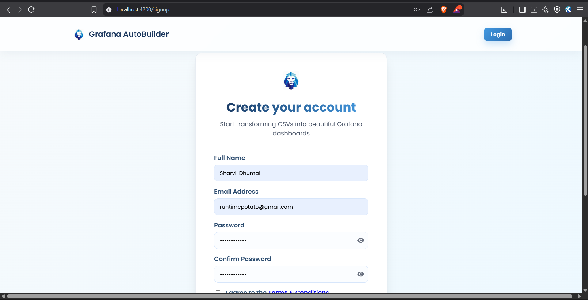
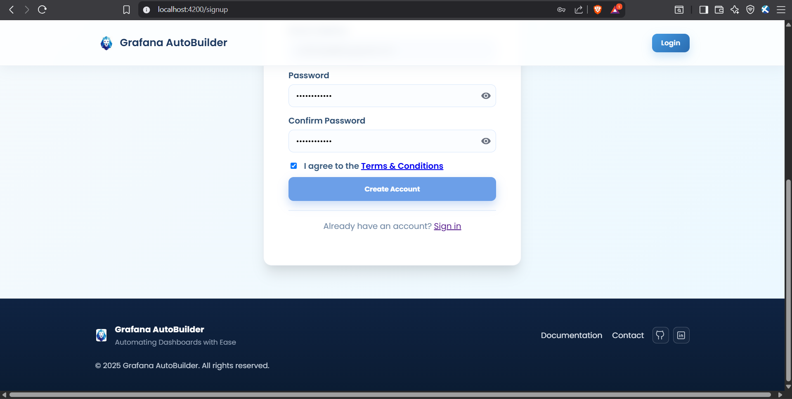
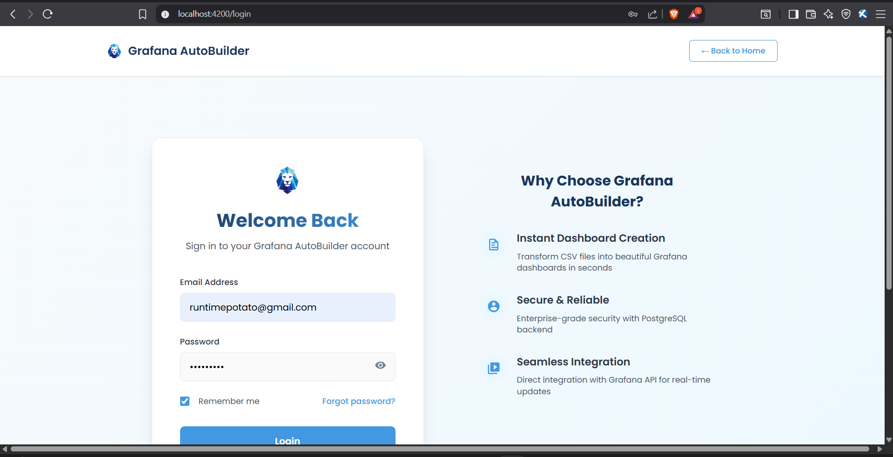
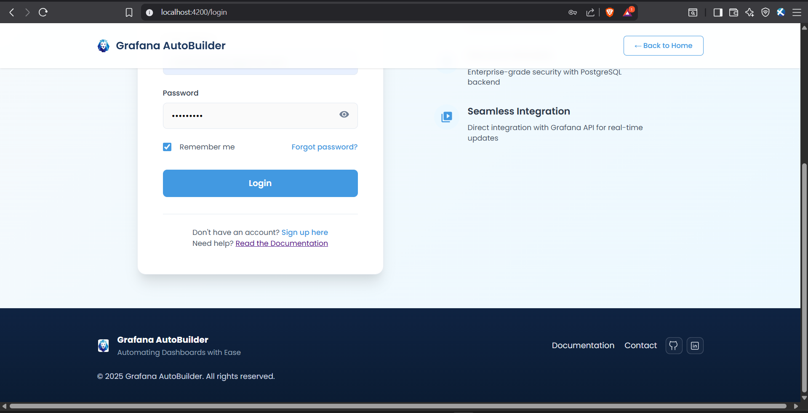
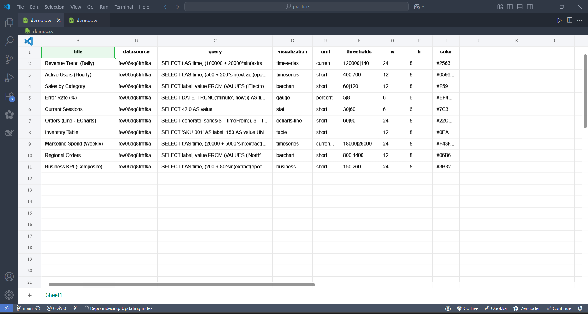

# Grafana Autobuilder — Dashboard Generation Guide (CSV ➜ Grafana)

This guide focuses only on generating Grafana dashboards from a CSV using the Admin Panel workflow. For installation, environment variables, backend/frontend startup, and database configuration, please see the project `README.md`. Image placeholders are included—replace them with your image links later.

> Notes
> - The project currently supports only PostgreSQL datasources.
> - You can use multiple PostgreSQL datasources per dashboard by specifying the datasource UID per CSV row.

---

## Table of Contents
- Overview
- Minimal Requirements
- Get Started (Login, Signup, Forgot Password)
- CSV Format (what the app expects)
- Generate via Website (Recommended)
- Alternative: Admin Panel (Upload & Metrics)
- Verify in Grafana
- Troubleshooting (CSV/build-focused)
- Quick Checklist

---

## Overview
The app ingests a CSV that describes dashboards/panels and automatically creates/updates dashboards in Grafana using the Grafana HTTP API. Datasource control is per-panel via the datasource UID.

---

## Architecture (at a glance)
1. CSV is uploaded via the Admin Panel.
2. Backend parses CSV and composes Grafana dashboard JSON.
3. Backend calls Grafana API to create/update dashboards.
4. Per-panel datasource is resolved via default settings or the per-row `datasource_uid`.

---

## Minimal Requirements
Before building dashboards, make sure you have:
- Grafana URL and an API token with dashboard write permissions.
- At least one PostgreSQL datasource configured in Grafana and its UID(s).
- Grafana Autobuilder app running and reachable (backend + frontend).
 - App access and credentials (log in to the web app before uploading/generating).

For how to install, configure, and start services, see `README.md`.

---

## Get Started (Login, Signup, Forgot Password)

### Signup
- Click "Sign Up" to create a new account.
- Provide required details (e.g., name, email, password), then submit.
- You'll receive a signup/verification email. Open it and click the link to verify your account (check spam if needed).
- After successful verification, proceed to Login.

### Login
- Click "Login" (top-right) in the web app.
- Enter your email and password, then submit.
- Required before you can upload a CSV and generate dashboards (Upload page or Admin Panel).
- If you get 401/Unauthorized, log in again and retry.

### Forgot Password
- Click "Forgot Password" on the Login page.
- Enter your registered email to receive a reset link.
- Open the link, set a new password, and log in again.

API endpoints (for integrators):
- POST `/api/auth/login`
- POST `/api/auth/signup`

---

## CSV Format (what the app expects)
Use the sample CSVs in the project root as templates:
- `sample_dashboard_minimal.csv`
- `sample_dashboard_minimal_with_uid.csv`
- `sample_panels.csv`
- `sample_panels_postgresql.csv`
- `complex_sample_postgresql.csv`

Key points:
- Only PostgreSQL datasources are supported currently.
- You can specify a datasource per row via a column like `datasource_uid`.
- Start from the samples and adjust titles, queries, panel types, and layout to your needs.
- Ensure any referenced tables/columns exist in your PostgreSQL database.

---

## Generate via Website (Recommended)
1. Login to the app.  
   - Use your credentials or sign up first if you’re new.  
   - 
2. Go to the Upload page (main website flow).
3. Select or drag-and-drop your CSV.  
   - Only `.csv` files are accepted; invalid files show an error.  
4. Click Generate.  
   - The app uploads the CSV via the dashboard service and waits for a response.
5. See the result.  
   - On success, you’ll get the dashboard info (and link if provided).  
   - On error, you’ll see an error message.

What happens behind the scenes:
- The backend parses your CSV and composes dashboard JSON.
- The backend calls the Grafana API to create/update the dashboard(s).

Tip: Check backend logs for validation or API errors.

 

---

## Alternative: Admin Panel (Upload & Metrics)
The Admin Panel also supports uploading a CSV to build dashboards and provides site metrics:

- Active Users (current activity)
- Total Visits/Site Count
- Recent Activity (CSV → Grafana conversions)

Upload via Admin Panel:
1. Open the Admin section.  
   - If authentication is enabled, log in or sign up.
2. Select your CSV and click Upload.  
   - Posts to `/api/files/upload` with `FormData` key `file`.
3. Review success or error in the panel.

Use the Admin Panel when you want to see metrics along with uploading. For most users, the main website Upload page is the simplest way to generate dashboards.

---

## Verify in Grafana
1. Open Grafana → Dashboards.
2. Locate the newly created/updated dashboard.
3. Open panels and confirm:
   - Queries run against the intended PostgreSQL datasource(s).
   - Visualizations, thresholds, units, and time ranges match expectations.

---

## Troubleshooting (CSV/build-focused)
- Dashboards not appearing  
  - Confirm your API token has dashboard write permissions.  
  - Check backend logs for Grafana API errors.  
  - Ensure the target folder/org (if specified) exists.
- Panels show errors / no data  
  - Verify SQL in CSV against real tables/columns in your DB.  
  - Ensure Grafana datasource connection works.  
  - If using `datasource_uid` per row, ensure those UIDs exist in Grafana.
- Multiple datasources in one dashboard  
  - Include `datasource_uid` per panel row, or set a default at build time.

For runtime/setup issues (install, auth, backend, frontend), see `README.md`.

---

## Quick Checklist
- [ ] Grafana URL + API token ready  
- [ ] PostgreSQL datasource UID(s) available in Grafana  
- [ ] CSV prepared from samples (with `datasource_uid` if needed)  
- [ ] Build triggered from Admin Panel  
- [ ] Dashboard verified in Grafana

